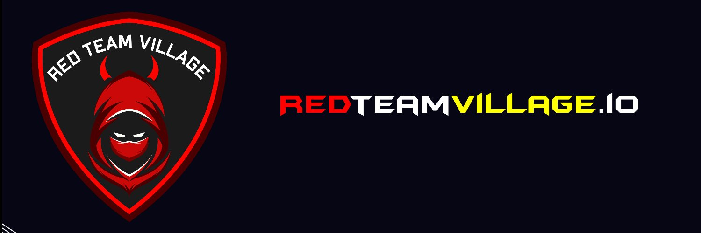

  

### 🇧🇷 I've been Working at Security Researcher and Security Advocate at [Zup Innovation](https://www.zup.com.br/). 🇧🇷

### Skill & Languages & Tools 🛠  
&nbsp;
&nbsp;
&nbsp;
&nbsp;
&nbsp;
&nbsp;
&nbsp; 
&nbsp;
&nbsp;
&nbsp;
&nbsp;
&nbsp;
&nbsp;
&nbsp;
&nbsp;
&nbsp;
&nbsp;
&nbsp;
&nbsp;
&nbsp;
&nbsp;

### Analytics ⚙️

### Let's connect? 🤝

### Projects ⚙️

      
