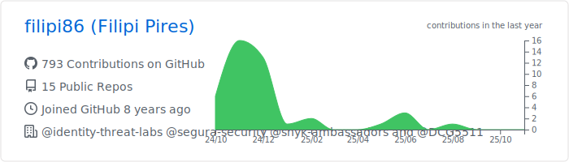
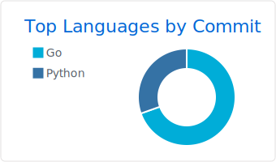

<h1> Hello World ! </h1>

### 🇧🇷 I'been Working at Security Researcher and Security Advocate at [Zup Innovation](https://www.zup.com.br/). 🇧🇷

### Languages & Tools 🛠

&nbsp;
&nbsp;
&nbsp;
&nbsp;
&nbsp;
&nbsp;
&nbsp;
&nbsp;
&nbsp;
&nbsp;
&nbsp;
&nbsp;
&nbsp;

### Analytics ⚙️

<!-- 

  
  
  

 -->

### Let's connect ? 🤝

#### _References: [Snake animation](https://github.com/Platane/snk) ➕ [Statistics](https://github.com/anuraghazra/github-readme-stats) ➕ [Summary Cards](https://github.com/vn7n24fzkq/github-profile-summary-cards)_

#### _[STEP by STEP to create a similar README profile](https://bit.ly/devtoritgithubcreateprofile) ⭐️_
